# LAB — день 7

> Скопируйте в `LAB.md` в корне `git-bootcamp-day-7` на **GitHub** и заполните по ходу работы.

## Базовая задача — `01-platforms-tour`

### Ссылки на репозитории

| Платформа | URL |
|-----------|-----|
| GitHub (основной) | https://github.com/sshopin/git-bootcamp-day-7 |
| GitLab | https://gitlab.com/sshopin/git-bootcamp-day-7 |
| GitFlic | https://gitflic.ru/project/sshopin/git-bootcamp-day-7 |
| GitVerse | https://gitverse.ru/sshopin/git-bootcamp-day-7 |

### GitLab — скриншоты (3)

1. SSH-ключ в UI:

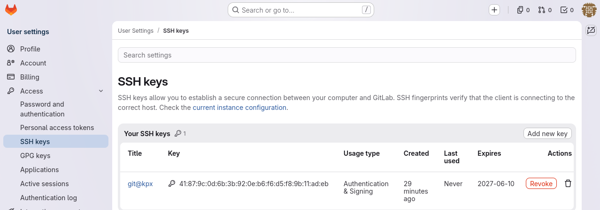

2. Терминал `ssh -T`:


3. Репозиторий после push (ветки + тег):

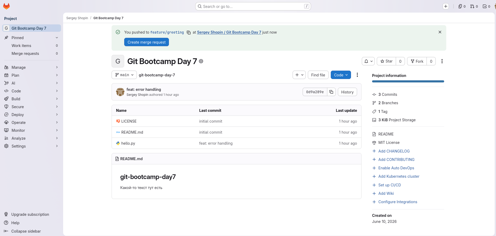

### GitFlic — скриншоты (3)

1. SSH-ключ в UI:

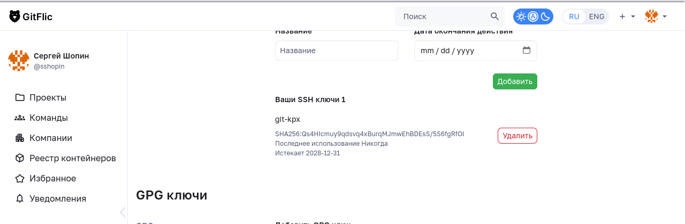

2. Терминал `ssh -T`:

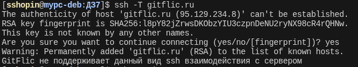

3. Репозиторий после push:

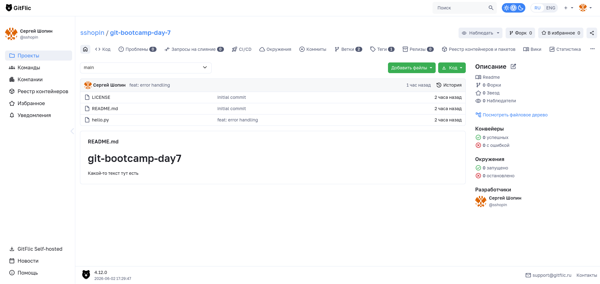

### GitVerse — скриншоты (3)

1. SSH-ключ в UI:

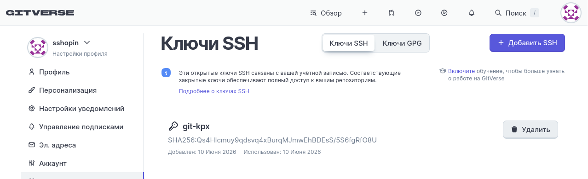

2. Терминал `ssh -T`:

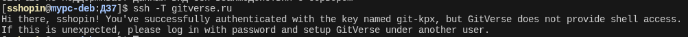

3. Репозиторий после push:

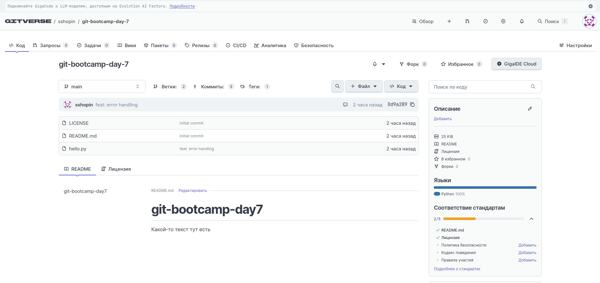

### Таблица сравнения платформ

| Возможность | GitHub | GitLab | GitFlic | GitVerse |
|-------------|--------|--------|---------|----------|
| SSH-ключ через UI | да | да  | да  | да |
| Markdown render в README | да | да | да | да |
| Issues встроены | да | да | Проблемы | Задачи |
| PR / Merge Request | PR | Merge Request | Merge Request | Pull Request |
| Встроенный CI | Actions | CI/CD | CI/CD | Workflows |
| Релизы / теги в UI | да | да | нет | нет |
| Видимость для незалогиненных | да | да  | да  | да  |
| Что-то особенное | нет | тормозит | нет | нет |

### Команды

```bash
# git remote add gitlab git@gitlab.com:sshopin/git-bootcamp-day-7.git
# git remote add gitflic git@gitflic.ru:sshopin/git-bootcamp-day-7.git
# git remote add gitverse git@gitverse.ru:sshopin/git-bootcamp-day-7.git

# git push -u gitflic main --tags
# git push -u gitflic feature/greeting --tags
# git push -u gitlab main --tags
# git push -u gitlab feature/greeting --tags
# git push -u gitverse main --tags
# git push -u gitverse feature/greeting --tags

# ssh -T git@gitlab.com
# ssh -T git@gitflic.ru
# ssh -T git@gitverse.ru
```

### Впечатления (2–3 предложения)

Продвинутыми функциями я не пользовался, с точки зрения обычного использования платформы очень похожи. Выделяется только gitlab, в котором интерфейс тормозит и на gitlab.com, а не только в локальном Community Edition.

---

## ⭐1 — bare headless

**Где bare на VM и URL remote `vm`:**

```bash
git remote add vm git@px-baregit:/srv/git/myrepo.git
git push vm --all
```

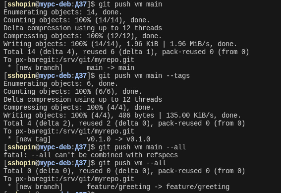

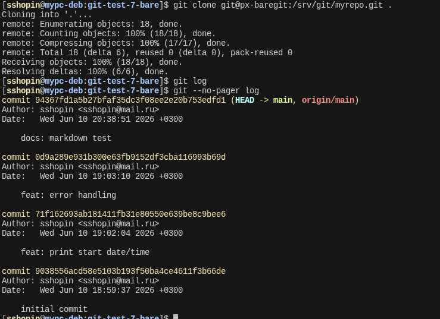

---

## ⭐2 — Gitea

**Чем UI Gitea отличается от GitHub (1 абзац):**
На первый взгляд особых отличий не видно, разница выглядит больше косметической. Возможно при углубленной работе проявится.


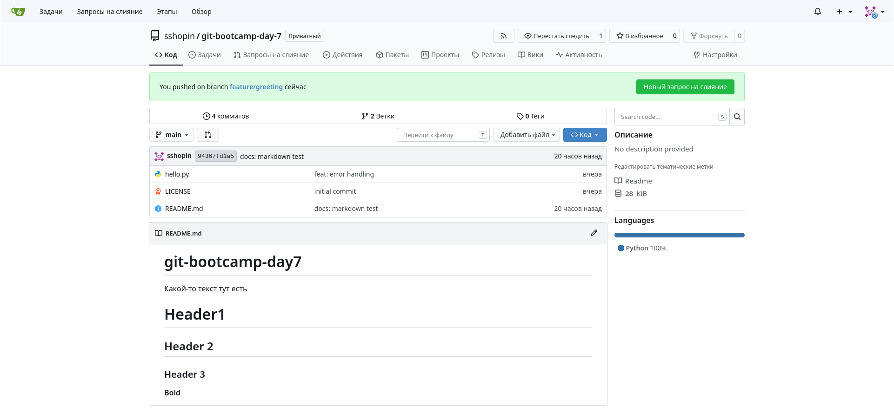

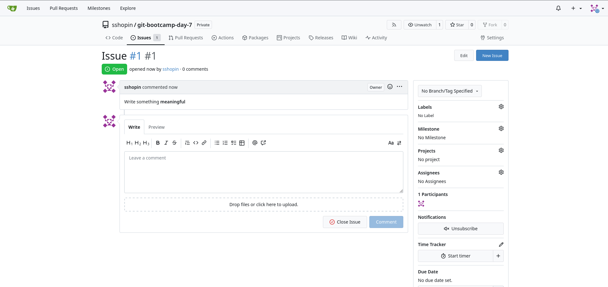

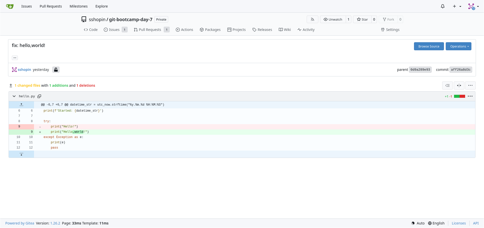

---

## ⭐3 — GitLab CE self-hosted

**GitLab CE vs Gitea: RAM, время старта (2–3 предложения):**
жрет много памяти ~8Гб даже при простых проектах, если делать некоторые оптимизации, которые всё равно не сильно снижают требования к памяти.
Gitlab CE - большой проект с большим числом компонентов, время запуска длительное.

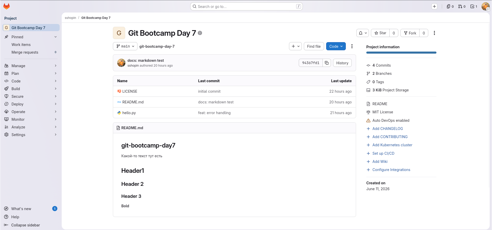

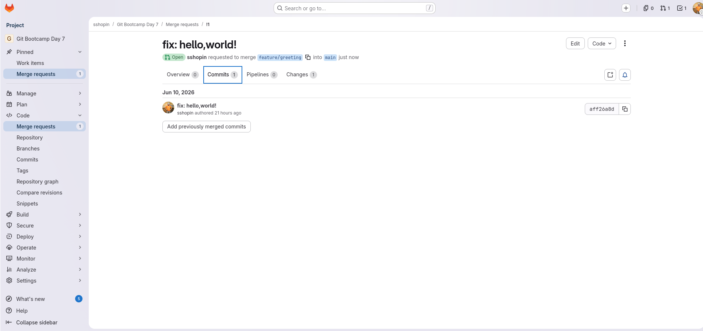

